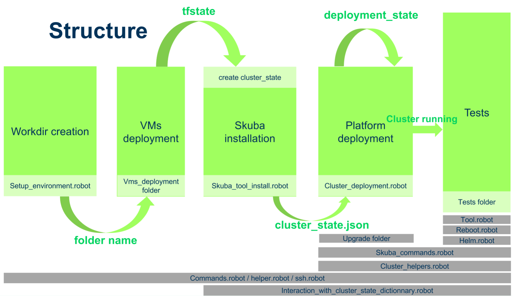

# caasp_robotframework

## Installation

Installed python requirements : 
- sudo pip install -r requirements.txt

You need to have this tools installed : 
- kubectl ( 1.17.3 )
- helm ( 2.16.1 )
- custom terraform 0.12.19 ( from caasp pattern )
- jq

## Setup environment
Configure ${CAASP_KEY} in parametes/env.robot by adding your SSC key

Configure your vmware and openstack setting in env.robot

For backup and restore test, configure your aws identification key

## Code Organization



## Execute test


```
robot -v PREFIX:<your name> -v NUMBER:<master:worker> -v PLATFORM:<openstack|vmware> --test <path to your test>  <caasp_robotframework_folder>
```
#### Exemples
*Deploy a cluster on vmware and keep it*

```
robot --argumentfile <path_to_project>/caasp_robotframework/argumentfiles/argumentfile-template.txt ./
```

*Run authentication test*
 ```
robot --test Caasp\ Robotframework.Test.Rbac.389ds_authentication -v NUMBER:1:3 -v PLATFORM:vmware -v PREFIX:myname --outputdir=tmp .
```
*More advance example :*
```
robot --test Caasp\ Robotframework.Test.Replica.dex_gangway_replicat -v MODE:DEV --variable PULL_REQUEST:951 -v PREFIX:myname -v NUMBER:1:3 -v PLATFORM:vmware --outputdir=tmp .
```

*Executing tests by tags :*
```
robot –include=release -v PREFIX:myname -v platform:aws -v number:1:2 ./
```

## Configuration available

You can change global variable by adding -v \<variablename\>:\<new value\>. Here some usefull variable

### Global
- `CLUSTER` : give a specific name for the cluster directory, if the name match a running cluster it will use this cluster for the test
- `VM_USER` : for aws, need to be change for ec2-user
- `PREFIX` : give a suffix to your cluster nodes names, could be your name
- `NUMBER` : number of master and worker for the test separated by `<master-number>:<worker-number>` 
- `PLATFORM` : ( vmware | openstack | aws ) specify a platform where to run the test 
- `KEEP`: keep cluster after test
- `NUMBER_OF_CLUSTER` : by default one, deploy number of cluster in the same robot framework session ( will use NUMBER for both of it)

### OIDC configuration

- `OIDC_CERT` : configure usage of oidc customize certificate  
   - `KEY` : setup oidc-ca with key
   - `NO_KEY` : use skuba cert generate-csr command to generate oidc certificates
   - `None` : no customization

### Installation customization 
- `MODE` : 
    - empty by default, skuba will be installed from pattern
    - DEV / STAGING / RELEASE : will build skuba from github project with choose option 
        . when using this mode,  you can specify a pull request number (pull-\<pull request number>) or a tag (tag-\<tag number>) with the variable `SKUBA_PULL_REQUEST`
- `
` : clone https://github.com/SUSE/kubernetes-charts-suse-com in LOGDIR and checkout to the pull request

### Upgrade part and install with RPM
- `UPGRADE` : by default false, if True, deploy the cluster with current pattern then add repo specify in RPM and upgrade cluster
- `RPM` : Skuba repo with upgrade
- `REGISTRY` : Registry repo with last container

### Caasp version
 - `VM_VERSION` : choose the vm version ( by default SP1 ), can be set to SP2
 - `CAASP_VERSION` : choose the caasp version. Can be 4 or 4.5 ( by default 4)